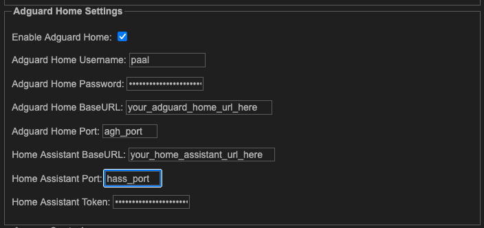

# LeechBlock NG E2E for Firefox

Now E2E!

This fork sends a request to add the websites on the activated block list to the filterered websites on an Adguard Home Instance, enabling a DNS level block in connection with the browser level block

# Leechblock Configuration

In the `General` page of the Leechblock options, there is a new section added for Adguard Home Options:



Fill out the corresponding fields with the info for your Adguard Home and Home Assistant instances.

The rule will send an HTTP request to your Adguard Home instance to block the domains in the domains list of the blocklist, and some Home Assistant configuration is needed to undo the rules when the block expires.

# Home Assistant Configuration

This is designed around my use case (Adguard Home running as a home assistant add on, using Firefox based browser), so YMMV if you try with other.

In order to make this function, you will need to create a datetime (Note: It must be a datetime helper specifically) helper in home assistant for each blocklist you have. At this time, the id **_must_** match blocklist\_`<num>`. Names that will generate this in Home assistant are: Blocklist `<num>`.

You will also need to create two automations.

The first called `reset_filtering_rules.sh`

```shell
curl --location 'https://localhost:3000/control/filtering/set_rules' --header 'Content-type: application/json' --header 'Authorization: Basic <adguard_home_token>' --data '{"rules":  [ "" ] }' -k
```

The `rules` list should be a list of rules that you would like permanently appled.

The second, called `unset_filtering_rules.sh`

```bash
#!/bin/bash

# The first argument sent to the script
remove_list="$1"

# Convert JSON array to bash array
mapfile -t remove_array < <(echo "$remove_list" | jq -r '.[]')

# Fetch the JSON from AdGuard
response=$(curl --location 'https://localhost:3000/control/filtering/status' \
    --header 'Content-type: application/json' \
    --header 'Authorization: Basic <adguard_home_token>' -k)

# Convert user_rules into a bash array
mapfile -t user_rules < <(echo "$response" | jq -r '.user_rules[]')

# Result array
filtered_rules=()

# Filter out items in remove_array
for rule in "${user_rules[@]}"; do
    skip=false
    for remove in "${remove_array[@]}"; do
        if [[ "$rule" == "$remove" ]]; then
            skip=true
            break
        fi
    done
    if ! $skip; then
        filtered_rules+=("$rule")
    fi
done

json_rules=$(printf '%s\n' "${filtered_rules[@]}" | jq -R . | jq -s .)

curl --location 'https://localhost:3000/control/filtering/set_rules' \
     --header 'Content-type: application/json' \
     --header 'Authorization: Basic <adguard_home_token>' \
     --data "{\"rules\": $json_rules}" \
     -k
```

## Create Automation

You'll need to create an automation to reset the filtered_services list in Adguard Home once the block expires in Leechblock.

Please note the vlueas in the `triggers[*].at` field. These are the entity IDs of the datetime helpers created earlier.

```yaml
alias: Unset Adguard Rules
description: ""
triggers:
  - trigger: time
    at: input_datetime.blocklist_1
    id: blocklist-1
    weekday:
      - sat
      - fri
      - thu
      - wed
      - tue
      - mon
      - sun
    enabled: true
  - trigger: time
    at: input_datetime.blocklist_2
    id: blocklist-2
    weekday:
      - sat
      - fri
      - thu
      - wed
      - tue
      - mon
      - sun
    enabled: true
  - trigger: time
    at: input_datetime.blocklist_3
    id: blocklist-3
    weekday:
      - sun
      - mon
      - tue
      - wed
      - thu
      - fri
      - sat
  - trigger: time
    at: input_datetime.blocklist_4
    id: blocklist-4
    weekday:
      - sat
      - fri
      - thu
      - wed
      - tue
      - mon
      - sun
    enabled: true
conditions: []
actions:
  - if:
      - condition: trigger
        id:
          - blocklist-1
    then:
      - action: shell_command.unset_filtering_rules
        metadata: {}
        data:
          rules_to_unset: |
            {{ state_attr('input_datetime.blocklist_1', 'rules') | to_json }}
  - if:
      - condition: trigger
        id:
          - blocklist-2
    then:
      - action: shell_command.unset_filtering_rules
        metadata: {}
        data:
          rules_to_unset: |
            {{ state_attr('input_datetime.blocklist_2', 'rules') | to_json }}
  - if:
      - condition: trigger
        id:
          - blocklist-3
    then:
      - action: shell_command.unset_filtering_rules
        metadata: {}
        data:
          rules_to_unset: |
            {{ state_attr('input_datetime.blocklist_3', 'rules') | to_json }}
  - if:
      - condition: trigger
        id:
          - blocklist-4
    then:
      - action: shell_command.unset_filtering_rules
        metadata: {}
        data:
          rules_to_unset: |
            {{ state_attr('input_datetime.blocklist_4', 'rules') | to_json }}
mode: single
```

---

[](https://github.com/humanetech-community/awesome-humane-tech)

LeechBlock NG (Next Generation) is a simple productivity tool designed to block those time-wasting sites that can suck the life out of your working day. All you need to do is specify which sites to block and when to block them.

**Author:** James Anderson

**Contributors:** Dario Kolac (graphics) & Robert Gützkow (graphics)

Note that the latest version of [jQuery UI](https://jqueryui.com/) should be installed in the subfolder `jquery-ui`.

**Policy on PRs:** I'm happy to consider PRs, but unless they're relatively simple (e.g., bug fixes or UI tweaks) it will take me some time to review and test them, and even then I may decide not to approve them. Please understand that LeechBlock is just a hobby for me, and I have very little time even to develop my own code, never mind other people's code! If you want to fork LeechBlock and release your own version, you're more than welcome.
